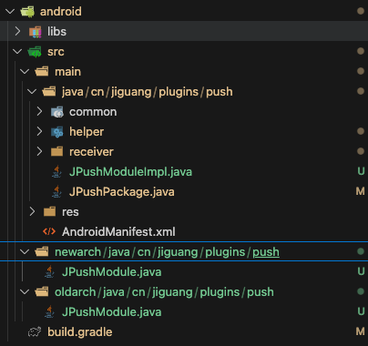

## 前情提要

RN 现在的版本已经到了 0.80(2025-6-28),新架构已经是默认开启的了，官方也在制定逐步取消对旧架构的维护支持，在未来的版本中会移除旧架构，所以对于旧架构原先的
第三方库也要做对应的兼容处理。目前大部分流行热门的第三方库都已经得到了适配，但是一些冷门的，还是停留在旧的版本，或者以前的一些私有封装的 sdk 还停留在旧版本，所以很有必要研究一下如何适配。故此，选择了 极光推送的 [jpush-react-native](https://github.com/jpush/jpush-react-native)作为练手。适配一个库是比较简单的，至少比从来开始写的工作量要少，我们只需要按照一定的格式规范 在旧架构的基础在做一些 “链接粘合”的工作即可。

## Step - 1 为 package.json 添加 codegenConfig

```json
{
  "name": "jpush-react-native",
  /*
    ......
  */
  "codegenConfig": {
    "name": "RNJPushSpec",
    "type": "modules",
    "jsSrcsDir": "specs",
    "android": {
      "javaPackageName": "cn.jiguang.plugins.push"
    }
  }
}
```

codegen : 为你的 Turbo Native Module 生成链接 到 RN 链接模版代码的一个工作。

"name": "RNJPushSpec", 这个生成模版代码的文件名字，这个在 iOS 中用到

```c++
#ifdef RCT_NEW_ARCH_ENABLED

#import <RNJPushSpec/RNJPushSpec.h>
  @interface RCTJPushModule: NSObject <NativeJpushSpec>


#else
  @interface RCTJPushModule : RCTEventEmitter <RCTBridgeModule>

@end

```

## Step -2 编写 specs 规范文件

我在 specs 目录下的 创建了 NativeJpush.ts。可以用 ts 或者 flow 编写，也是有模版的，这里定义的是，原生暴露出来的 js 方法。

```ts
import type { TurboModule } from "react-native";
import { TurboModuleRegistry } from "react-native";
/*
 编写这个文件需要注意的是,要注意 ts 类型 到  java 或者 oc 之中的映射，
 要不然变异会报错，注意 参数名称 不能是 平台代码的关键字 
  setDebugMode: (bool: boolean) => void;
  这个转化在成 c++ 是会报错的，因为用了 bool ,这个需要注意。
  类型的对照表，可以参考如下链接。
  https://reactnative.dev/docs/appendix#ii-codegen-typings
*/
export interface Spec extends TurboModule {
  setDebugMode: (enable: boolean) => void;
  isPushStopped: (cb: () => void) => void;
  setChannel: (obj: Object) => void;
  //****
}
// JPushModule 这个是我们定义的导出库的名字，Android 和 ios 需要一致
export default TurboModuleRegistry.getEnforcing<Spec>("JPushModule");
```

### Android

codegen 会根据这个文件生成模版代码文件 NativeJpushSpec（位于库中 android/build/generated/codegen ),我们会继承覆盖实现这个抽象类中的方法

```java

/**
 * This code was generated by [react-native-codegen](https://www.npmjs.com/package/react-native-codegen).
 *
 * Do not edit this file as changes may cause incorrect behavior and will be lost
 * once the code is regenerated.
 *
 * @generated by codegen project: GenerateModuleJavaSpec.js
 *
 * @nolint
 */

package cn.jiguang.plugins.push;

import com.facebook.proguard.annotations.DoNotStrip;
import com.facebook.react.bridge.Callback;
import com.facebook.react.bridge.ReactApplicationContext;
import com.facebook.react.bridge.ReactContextBaseJavaModule;
import com.facebook.react.bridge.ReactMethod;
import com.facebook.react.bridge.ReadableMap;
import com.facebook.react.turbomodule.core.interfaces.TurboModule;
import javax.annotation.Nonnull;

public abstract class NativeJpushSpec extends ReactContextBaseJavaModule implements TurboModule {
  public static final String NAME = "JPushModule";

  public NativeJpushSpec(ReactApplicationContext reactContext) {
    super(reactContext);
  }

  @Override
  public @Nonnull String getName() {
    return NAME;
  }

  @ReactMethod
  @DoNotStrip
  public abstract void setDebugMode(boolean enable);

  @ReactMethod
  @DoNotStrip
  public abstract void init();


}

```

## Step-3 Android 改造

改造后的目录结构如下


### 3-1 grade.build 文件的改造

**主要是 根据是否判断新旧架构，引入相关的依赖和，添加选择对应的 源 java 目录**

```diff

apply plugin: 'com.android.library'

+ def isNewArchitectureEnabled() {
+    return project.hasProperty("newArchEnabled") && project.newArchEnabled == "true"
}

+ if (isNewArchitectureEnabled()) {
+    apply plugin: 'com.facebook.react'
+}

def safeExtGet(prop, fallback) {
    rootProject.ext.has(prop) ? rootProject.ext.get(prop) : fallback
}


android {
    compileSdkVersion safeExtGet('compileSdkVersion', 34)

    namespace 'cn.jiguang.plugins.push'

    defaultConfig {
        minSdkVersion safeExtGet('minSdkVersion', 23)
        targetSdkVersion safeExtGet('targetSdkVersion', 34)
        versionCode 1
        versionName "1.0"
+        buildConfigField("boolean", "IS_NEW_ARCHITECTURE_ENABLED", isNewArchitectureEnabled().toString())
    }

+     sourceSets {
+        main {
+            if (isNewArchitectureEnabled()) {
+                java.srcDirs += ['src/newarch']
+            } else {
+                java.srcDirs += ['src/oldarch']
+            }
+        }
+    }
}

dependencies {
    implementation fileTree(dir: 'libs', include: ['*.jar'])
    implementation 'com.facebook.react:react-native:+'
}


```

### 3-2 JPushModuleImpl 文件的改造。

JPushModuleImpl 文件是由 JPushModule 改造而来，是真正实现功能的地方。

```java

package cn.jiguang.plugins.push;
import android.app.NotificationChannel;
import android.app.NotificationManager;
import android.net.Uri;
import android.os.Build;
import android.app.Activity;
import android.app.Application;
import android.os.Bundle;
import android.text.TextUtils;
import android.util.Log;

import com.facebook.react.bridge.Arguments;
import com.facebook.react.bridge.Callback;
import com.facebook.react.bridge.ReactApplicationContext;
import com.facebook.react.bridge.ReactContextBaseJavaModule;
import com.facebook.react.bridge.ReactMethod;
import com.facebook.react.bridge.ReadableArray;
import com.facebook.react.bridge.ReadableMap;
import com.facebook.react.bridge.ReadableNativeMap;
import com.facebook.react.bridge.WritableMap;

import org.json.JSONObject;

import java.util.HashMap;
import java.util.HashSet;
import java.util.Set;
import java.lang.*;

import cn.jiguang.plugins.push.common.JConstants;
import cn.jiguang.plugins.push.common.JLogger;
import cn.jiguang.plugins.push.helper.JPushHelper;
import cn.jiguang.plugins.push.receiver.JPushBroadcastReceiver;
import cn.jpush.android.api.BasicPushNotificationBuilder;
import cn.jpush.android.api.JPushInterface;
import cn.jpush.android.data.JPushCollectControl;
import cn.jpush.android.data.JPushLocalNotification;

// 当初的实现类
public class JPushModuleImpl  {


    public static ReactApplicationContext reactContext;

    public static boolean isAppForeground = false;

   // 定义一个 模块的名字
    public static final String NAME = "JPushModule";

  // 构造函数，需要用到 reactContext 上下文环境，我们可以从构造函数传入，这个在真正导出那里
  // 实例化
    public JPushModuleImpl(ReactApplicationContext reactApplicationContext) {
        reactContext = reactApplicationContext;
    }


   // 内部的实现方法
    public void setDebugMode(boolean enable) {
        JPushInterface.setDebugMode(enable);
        JLogger.setLoggerEnable(enable);
    }
}
```

### 3-3 JPushPackage 文件的改造。

这个文件，也是模版代码，照参考的改就好了。

```java

package cn.jiguang.plugins.push;

import androidx.annotation.Nullable;
import com.facebook.react.bridge.NativeModule;
import com.facebook.react.bridge.ReactApplicationContext;
import com.facebook.react.module.model.ReactModuleInfo;
import com.facebook.react.module.model.ReactModuleInfoProvider;
import com.facebook.react.TurboReactPackage;
import com.facebook.react.uimanager.ViewManager;


import java.util.ArrayList;
import java.util.Collections;
import java.util.List;
import java.util.HashMap;
import java.util.Map;

// ⚠️ 继承的是TurboReactPackage
public class JPushPackage extends TurboReactPackage {

    @Nullable
    @Override
    public NativeModule getModule(String name, ReactApplicationContext reactContext) {
        if (name.equals(JPushModuleImpl.NAME)) {
            return new JPushModule(reactContext);
        } else {
            return null;
        }
    }

    @Override
    public ReactModuleInfoProvider getReactModuleInfoProvider() {
        return () -> {
            final Map<String, ReactModuleInfo> moduleInfos = new HashMap<>();
            boolean isTurboModule = BuildConfig.IS_NEW_ARCHITECTURE_ENABLED;
            moduleInfos.put(
                    JPushModuleImpl.NAME,
                    new ReactModuleInfo(
                            JPushModuleImpl.NAME,
                            JPushModuleImpl.NAME,
                            false, // canOverrideExistingModule
                            false, // needsEagerInit
                            true, // hasConstants
                            false, // isCxxModule
                            isTurboModule // isTurboModule
            ));
            return moduleInfos;
        };
    }

}
```

### step-3. 新架构 newarch 目录下的 JPushModule.java

继承实现 NativeJpushSpec 类中的方法,实例化 JPushModuleImpl 类 作为代理，调用真正的实现方式

```java
package cn.jiguang.plugins.push;

import android.app.NotificationChannel;
import android.app.NotificationManager;
import android.net.Uri;
import android.os.Build;
import android.app.Activity;
import android.app.Application;
import android.os.Bundle;
import android.text.TextUtils;
import android.util.Log;

import com.facebook.react.bridge.Arguments;
import com.facebook.react.bridge.Callback;
import com.facebook.react.bridge.ReactApplicationContext;
import com.facebook.react.bridge.ReactContextBaseJavaModule;
import com.facebook.react.bridge.ReactMethod;
import com.facebook.react.bridge.ReadableArray;
import com.facebook.react.bridge.ReadableMap;
import com.facebook.react.bridge.ReadableNativeMap;
import com.facebook.react.bridge.WritableMap;
import com.facebook.react.bridge.NativeModule;
import com.facebook.react.bridge.Promise;
import com.facebook.react.bridge.ReactContext;

import org.json.JSONObject;

import java.util.HashMap;
import java.util.HashSet;
import java.util.Set;
import java.lang.*;

import cn.jiguang.plugins.push.common.JConstants;
import cn.jiguang.plugins.push.common.JLogger;
import cn.jiguang.plugins.push.helper.JPushHelper;
import cn.jiguang.plugins.push.receiver.JPushBroadcastReceiver;
import cn.jpush.android.api.BasicPushNotificationBuilder;
import cn.jpush.android.api.JPushInterface;
import cn.jpush.android.data.JPushCollectControl;
import cn.jpush.android.data.JPushLocalNotification;


public class JPushModule extends NativeJpushSpec {

    private final JPushModuleImpl delegate;

    public JPushModule(ReactApplicationContext reactContext) {
        super(reactContext);
        delegate = new JPushModuleImpl(reactContext);
    }

    @Override
    public String getName() {
        return JPushModuleImpl.NAME;
    }

    @Override
    public void setDebugMode(boolean enable) {
        delegate.setDebugMode(enable);
    }

    @Override
    public void init() {
        delegate.init();
    }


}
```

### step-4 旧架构 oldarch 下的 JPushModule.java

此文件为 原旧架构的 JPushModule，不同的是，实例化了 JPushModuleImpl 作为了代理实现各个方法

```java
  package cn.jiguang.plugins.push;

import android.app.NotificationChannel;
import android.app.NotificationManager;
import android.net.Uri;
import android.os.Build;
import android.app.Activity;
import android.app.Application;
import android.os.Bundle;
import android.text.TextUtils;
import android.util.Log;

import com.facebook.react.bridge.Arguments;
import com.facebook.react.bridge.Callback;
import com.facebook.react.bridge.ReactApplicationContext;
import com.facebook.react.bridge.ReactContextBaseJavaModule;
import com.facebook.react.bridge.ReactMethod;
import com.facebook.react.bridge.ReadableArray;
import com.facebook.react.bridge.ReadableMap;
import com.facebook.react.bridge.ReadableNativeMap;
import com.facebook.react.bridge.WritableMap;

import org.json.JSONObject;

import java.util.HashMap;
import java.util.HashSet;
import java.util.Set;
import java.lang.*;

import cn.jiguang.plugins.push.common.JConstants;
import cn.jiguang.plugins.push.common.JLogger;
import cn.jiguang.plugins.push.helper.JPushHelper;
import cn.jiguang.plugins.push.receiver.JPushBroadcastReceiver;
import cn.jpush.android.api.BasicPushNotificationBuilder;
import cn.jpush.android.api.JPushInterface;
import cn.jpush.android.data.JPushCollectControl;
import cn.jpush.android.data.JPushLocalNotification;

public class JPushModule extends ReactContextBaseJavaModule {

    private final JPushModuleImpl delegate;

    public JPushModule(ReactApplicationContext reactContext) {
        super(reactContext);
        delegate = new JPushModuleImpl(reactContext);
    }

    @Override
    public String getName() {
        return JPushModuleImpl.NAME;
    }

    @ReactMethod
    public void setDebugMode(boolean enable) {
        delegate.setDebugMode(enable);
    }

    @ReactMethod
    public void init() {
        delegate.init();
    }

    @ReactMethod
    public void stopPush() {
        delegate.stopPush();
    }

    @ReactMethod
    public void resumePush() {
        delegate.resumePush();
    }

    @ReactMethod
    public void isPushStopped(Callback callback) {
        delegate.isPushStopped(callback);
    }

    @ReactMethod
    public void setChannel(ReadableMap readableMap) {
        delegate.setChannel(readableMap);
    }

    @ReactMethod
    public void setChannelAndSound(ReadableMap readableMap) {
        delegate.setChannelAndSound(readableMap);
    }

    @ReactMethod
    public void setLinkMergeEnable(boolean enable) {
        delegate.setLinkMergeEnable(enable);
    }

    @ReactMethod
    public void setSmartPushEnable(boolean enable) {
        delegate.setSmartPushEnable(enable);
    }

    @ReactMethod
    public void setDataInsightsEnable(boolean enable) {
        delegate.setDataInsightsEnable(enable);
    }

    @ReactMethod
    public void setGeofenceEnable(boolean enable) {
        delegate.setGeofenceEnable(enable);
    }

    @ReactMethod
    public void setCollectControl(ReadableMap readableMap) {
        delegate.setCollectControl(readableMap);
    }

    @ReactMethod
    public void setBadgeNumber(ReadableMap readableMap) {
        delegate.setBadgeNumber(readableMap);
    }


}
```

## Step 4 iOS 改造

## Step 4-1 JPushRN.podspec 文件的改造 cocoapods 的依赖配置文件

```diff
  require 'json'
pjson = JSON.parse(File.read('package.json'))

+ fabric_enabled = ENV['RCT_NEW_ARCH_ENABLED'] == '1'


Pod::Spec.new do |s|

  s.name            = "JPushRN"
  s.version         = pjson["version"]
  s.homepage        = pjson["homepage"]
  s.summary         = pjson["description"]
  s.license         = pjson["license"]
  s.author          = pjson["author"]

  s.platforms       = { :ios => "11.0" }
  s.frameworks      = 'UIKit','CFNetwork','CoreFoundation','CoreTelephony','SystemConfiguration','CoreGraphics','Foundation','Security'
  s.source          = { :git => "https://github.com/jpush/jpush-react-native.git", :tag => "#{s.version}" }
  s.source_files    = "ios/**/*.{h,m,mm,swift}"
  s.preserve_paths  = "*.js"
  s.weak_frameworks = 'UserNotifications'
  s.libraries       = 'z','resolv'
  s.vendored_frameworks = "ios/RCTJPushModule/*.xcframework"

+  if fabric_enabled
+    # Use install_modules_dependencies helper to install the dependencies if React Native version >=0.71.0.
+    # See https://github.com/facebook/react-native/blob/febf6b7f33fdb4904669f99d795eba4c0f95d7bf/scripts/cocoapods/+ new_architecture.rb#L79.
+   if respond_to?(:install_modules_dependencies, true)
+      install_modules_dependencies(s)
+    else
+      # just for backward compatibility: if React Native version <= 0.70.x
+      s.compiler_flags = "-DFOLLY_NO_CONFIG -DFOLLY_MOBILE=1 -DFOLLY_USE_LIBCPP=1 -Wno-comma -Wno-shorten-64-to-32 -DRCT_NEW_ARCH_ENABLED=1"
+      s.pod_target_xcconfig    = {
+        "HEADER_SEARCH_PATHS" => "\"$(PODS_ROOT)/boost\"",
+        "OTHER_CPLUSPLUSFLAGS" => "-DFOLLY_NO_CONFIG -DFOLLY_MOBILE=1 -DFOLLY_USE_LIBCPP=1",
+        "CLANG_CXX_LANGUAGE_STANDARD" => "c++17"
+      }

+      s.dependency 'React-Core'
+      s.dependency "React-Codegen"
+      s.dependency "React-RCTFabric"
+      s.dependency "RCT-Folly"
+      s.dependency "RCTRequired"
+      s.dependency "RCTTypeSafety"
+      s.dependency "ReactCommon/turbomodule/core"
+    end
+  else
+    s.dependency 'React-Core'
+  end
end
```

### step 4-1 RCTJPushModule.h 文件改造

```diff
+   #ifdef RCT_NEW_ARCH_ENABLED

+ #import <RNJPushSpec/RNJPushSpec.h>
+          /*注意这里 NativeJpushSpec 是为 specs 目录下文件的名字 */
+  @interface RCTJPushModule: NSObject <NativeJpushSpec>


+ #else
+  @interface RCTJPushModule : RCTEventEmitter <RCTBridgeModule>
+ endif

+ @end
```

### step-4-2 RCTJPushModule.m 文件 改为 RCTJPushModule.mm

```diff

+  #if RCT_NEW_ARCH_ENABLED
+ #import <RNJPushSpec/RNJPushSpec.h>
+ #endif

+ # pragma mark - New Architecture
+ #if RCT_NEW_ARCH_ENABLED
+ - (std::shared_ptr<facebook::react::TurboModule>)getTurboModule:
+    (const facebook::react::ObjCTurboModule::InitParams &)params
+ {
+      //     注意 NativeJpushSpecJSI 这个名字 NativeJpushSpe+JSI 这是由codegen 生成的
+    return std::make_shared<facebook::react::NativeJpushSpecJSI>(params);
+ }
#endif

```

### 兼容感想

对 原生的各种报错一脸懵逼，但好在有 ai 的答疑，也解决了不少的问题，这次对新架构更多了一些了解。

## 参考链接

- [Turbo Native Module](https://reactnative.dev/docs/turbo-native-modules-introduction)
- [向后兼容代码库](https://github.com/react-native-community/RNNewArchitectureLibraries.git)

```

```
