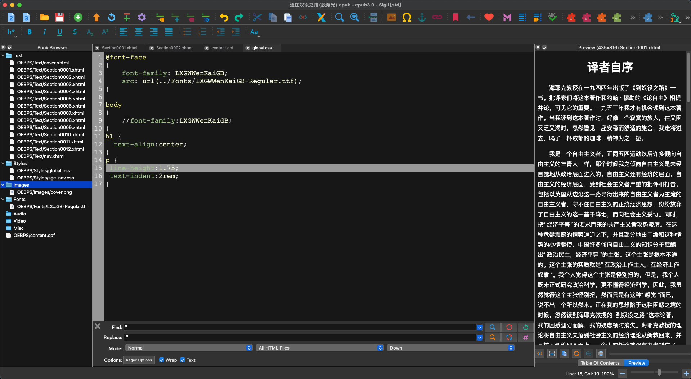

## 需求

以往看书，找的电子书的格式都是 pdf，但之后便发现，pdf 文件在手机屏幕显示是“有限的”。目前的众多 app，并不能较好的处理 pdf 在手机上的显示,比如：wps,一旦放大字体，就是需要滑动着看了，连自身自带的自适应布局模式，也还是有一些问题。分页的处理排版不好，而且“复制阻塞不便”，后来接触了 epub 格式的电子书，
用“苹果图书打开”，上述所说的问题全没了。自此之后，找的书籍格式都为 epub,对于最新出的书籍，安娜图书馆倒是能找到 epub 格式，但对于老旧偏门的书籍，只有一些扫描或者粗制的 pdf 版本，比如《通往奴役之路 殷海光译》。所以产生了制作 epub 的想法。

## epub

epub 文档是 web 电子书格式， 其本质就是写 html css ，搞排版。

## 推荐软件

- epubBuilder
- pages

- [sigil](https://sigil-ebook.com/sigil/download/)
- [calibre](https://calibre-ebook.com/)(转换图书文件格式)

## sigil 工具

一款编辑 equb 文档的编辑器。

要想快速的熟悉一款工具，那么最好的做法就是 导入一个相对完整的“项目”，修修改改，熟悉各项功能，然后再实际完整的完成一个项目。

针对 "sigil"工具，我们需要做的就是，找一个别人制作精美的 epub 电子，然后导入其中，看看里面的整理架构，需要设置的一些参数，我们在
做我们自己的 epub 的时候，复制一些过来就可以了。



从这个图可以了解到，文件资源管理器的目录结构跟前端项目类似，各自对应目录放各自资源。

做 epub，最主要的是给内容校正排版，可以使用正则替换一些内容，在样式方面，可以用自己喜欢的字体修饰文本，但引入字体文件会使文件增大，还有如果想发布到公众平台，还是用默认的字体较好。

```css
@font-face {
  font-family: LXGWWenKaiGB;
  src: url(../Fonts/LXGWWenKaiGB-Regular.ttf);
}

body {
  font-family: LXGWWenKaiGB;
}

h1 {
  text-align: center;
}
p {
  line-height: 1.75;
  text-indent: 2rem;
}

blockquote {
  padding: 0;
  margin: 0;
  text-indent: 2rem;
  line-height: 1.75;
}
blockquote + div {
  margin-top: 0.5rem;
  text-align: right;
  padding-right: 1rem;
}

b {
  color: yellow;
}
b::before {
  content: "⚠️ ";
}
```

## 教程

https://www.bilibili.com/video/BV1WL411y7Pg?spm_id_from=333.788.recommend_more_video.2&vd_source=83d090f7d3253dafc533d5d00ea84d14
