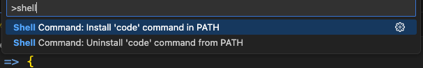
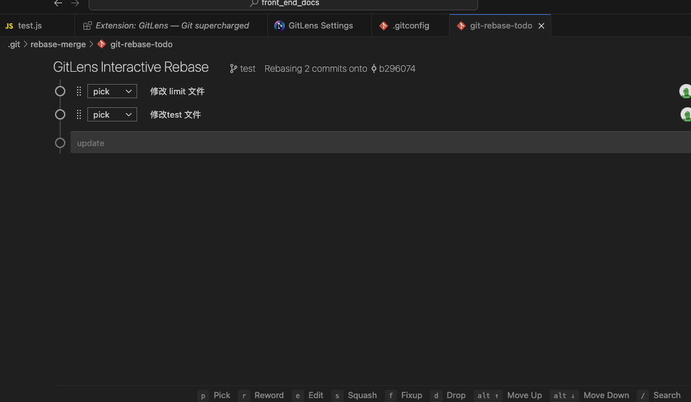

## 使用场景

1. 保持 git commit 记录清晰

2. 利于 cheery picker

如果要应对定制化的需求，这是不可避免的要用到这个功能。
比如，主分支是通用代码，而分支客户 1，客户 2 都是从主分支切出来的，修改了一些配置。

现如今有功能分支 fn,不可避免的在 fn 上多个 commit 记录，这个时候 如果客户 1 要用到 fn 的功能。
直接合并那是不行的，因为会冲突，所以需要一个 cheery pick ,但我只想有一个 cheery pick。
所以就需要把多个 commit 合并成一个，git 也提供这样的功能

## vim 上操作

1. 在当前分支 fn 下执行
   `git rebase i master`

此举是与主分支，进行 commit 比较，而后进入了 vim 交互模式 ，按 i 进行编辑

2. 指令解释（交互编辑时使用）

```vim

p, pick = use commit
r, reword = use commit, but edit the commit message
e, edit = use commit, but stop for amending
s, squash = use commit, but meld into previous commit
f, fixup = like "squash", but discard this commit's log message
x, exec = run command (the rest of the line) using shell
d, drop = remove commit

```

一般而言用，除第一条指令外，剩下的由"pick"改为 "squash" 就可以了。

:wq 保存离开,

3. 进入注释编辑界面

编辑此次合并的 commit，也可以直接:wq 保存离开。至此也是最后一步。

## 交互式操作

如果每次用原生自带的 git ,使用命令行搞，那么效率太低，且不直观，还好有 vscode 插件 **gitLens** 提供交互式的界面

前置条件:

1. git 的配置
   `git config --global sequence.editor "code --wait --reuse-window"`

2. vscode code 命令的安装
   `win+shift+p`->shell command install code command in path



使用

`git rebase i master`



参考文章视频

- https://cloud.tencent.com/developer/article/1690638
- https://www.youtube.com/watch?v=P5p71fguFNI
