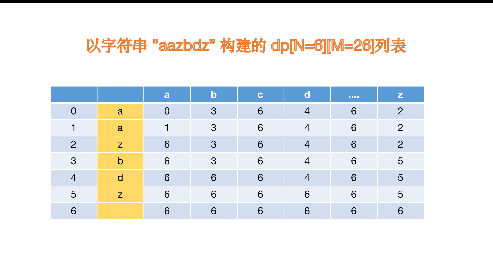

# [子序列匹配](https://leetcode-cn.com/problems/is-subsequence/solution/dui-hou-xu-tiao-zhan-de-yi-xie-si-kao-ru-he-kuai-s/)

给定字符串 s 和 t ，判断 s 是否为 t 的子序列。

字符串的一个子序列是原始字符串删除一些（也可以不删除）字符而不改变剩余字符相对位置形成的新字符串。（例如，"ace"是"abcde"的一个子序列，而"aec"不是）。

进阶：

如果有大量输入的 S，称作 S1, S2, ... , Sk 其中 k >= 10 亿，你需要依次检查它们是否为 T 的子序列。在这种情况下，你会怎样改变代码？

## 分析

这道题用动态规划也不太容易明白。我们首先还是先看 dp[i] 的定义。

`dp[i][j]`:代表 `i` 位置之后，`j` 字符第一次出现的位置。这个不好理解，我们来看如下图片。



行代表 "aazbdz" 中的每一个字符,列代表每一个字符在某个字符之后出现的第一个位置。

- 值 6 代表，该行字符之后，没有该字符串。
  比如 “z” 字符之后，再也没有字符了，所以有

```js
   dp[5][0]=6    //代表，‘z’ 字符之后没有找到'a'
   dp[5][1]=6 //代表，‘z’ 字符之后没有找到'b'
   ...

   dp[5][25]=5  // 'z' 字符之后，第一次出现‘z’字符串的位置

   /*
      依照此规律，填充 dp[i][j] 的值
      那么我们发现了，dp[i][j]的状态转移方程

      dp[i][j]=dp[i+1][j]  t[i]!=j
      dp[i][j]=i           t[i]==j

      注意写代码的时候，从后遍历.....

   */
```

## 完整代码实现

```c++
class Solution {
public:
    bool isSubsequence(string s, string t) {
        int n = s.size(), m = t.size();

        // 注意 m+1  行
        vector<vector<int> > f(m + 1, vector<int>(26, 0));

        // 最后一行 默认值 为 m, 代表之后 无 该 字符
        for (int i = 0; i < 26; i++) {
            f[m][i] = m;
        }
        // 填充  dp[i][j] ,从最后一行开始遍历
        for (int i = m - 1; i >= 0; i--) {
            for (int j = 0; j < 26; j++) {
                if (t[i] == j + 'a')
                    f[i][j] = i;
                else
                    f[i][j] = f[i + 1][j];
            }
        }

        /*
            构建好了之后，接下来就是匹配了。下面的代码虽短，却很难理解。
            结合 具体的 来 分析一下。 s="abz"。

            从dp 中的第一行开始匹配 。

            第一轮
            f[0][0]=0， 0!=6
            add=0+1;

            第二轮
            f[1][1]=3    3!=6
            add= 3+1 =4

            第三轮        5!=6
            f[4][25]=5
            add= 5+1 =6

        */
        int add = 0;
        for (int i = 0; i < n; i++) {
            //  如果在某个字符之后，开始寻找“当前字符”，
            // 且没有找到 有找到，很简单，那就是 不匹配.
            if (f[add][s[i] - 'a'] == m) {
                return false;
            }
            // 找到，该字符出现的位置，下一行继续寻找（+1）
            add = f[add][s[i] - 'a'] + 1;
        }
        return true;
    }
};


```

## 经验教训

这道题有三个关键点

- 建立 某个字符之后，a-z 第一次出现的位置 的 表 ,即构建 `dp[i][j]`,⚠️：是从后往前构建
- 字符的匹配是跳跃式的。对于很长的 s,很多的 s,这比双指针的效率要好。
